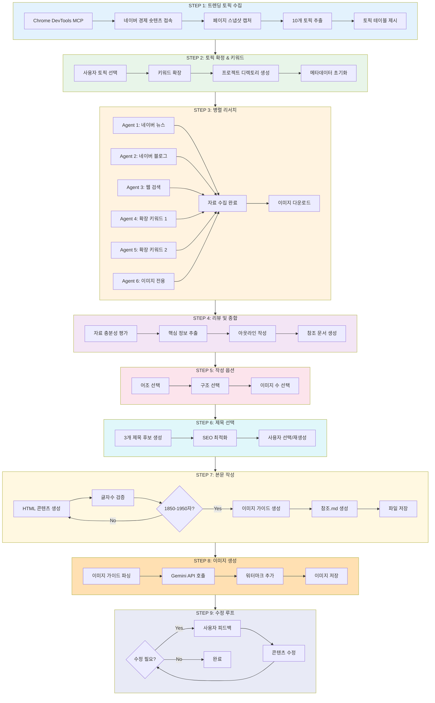
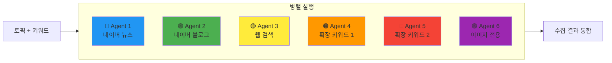
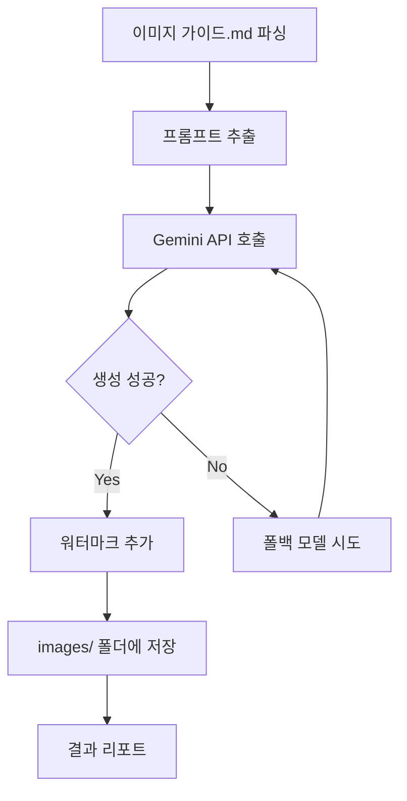
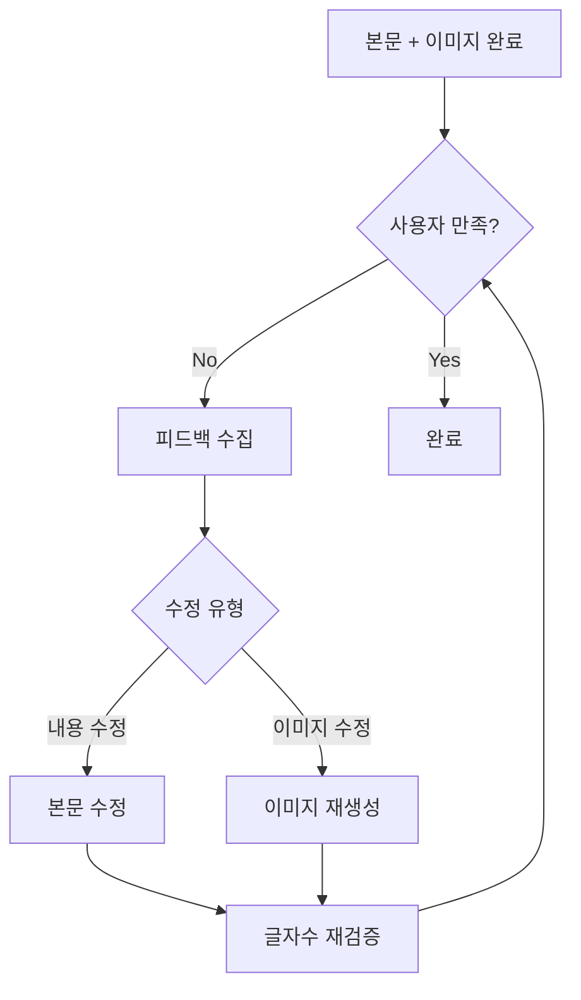
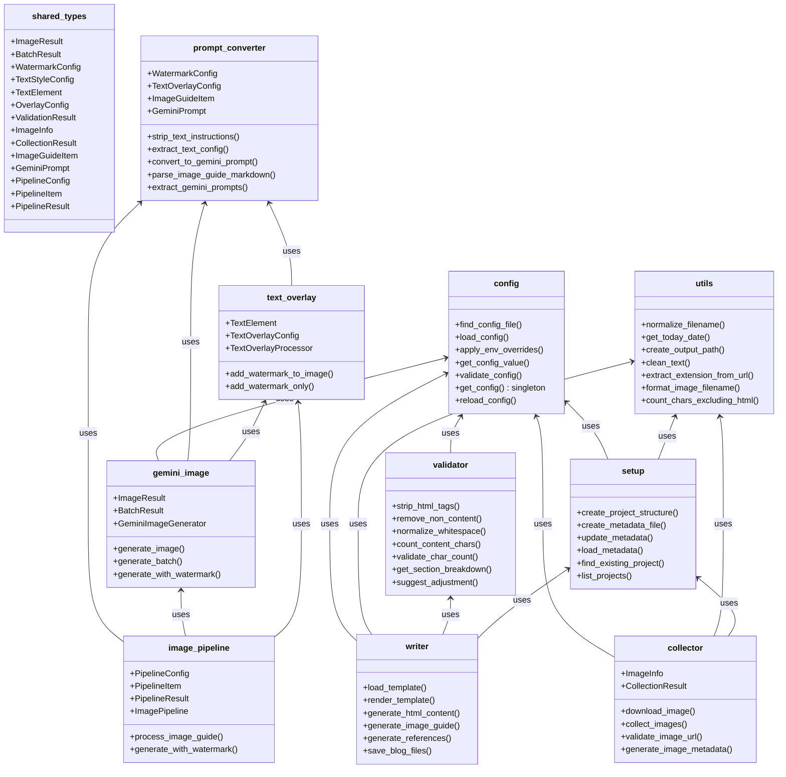
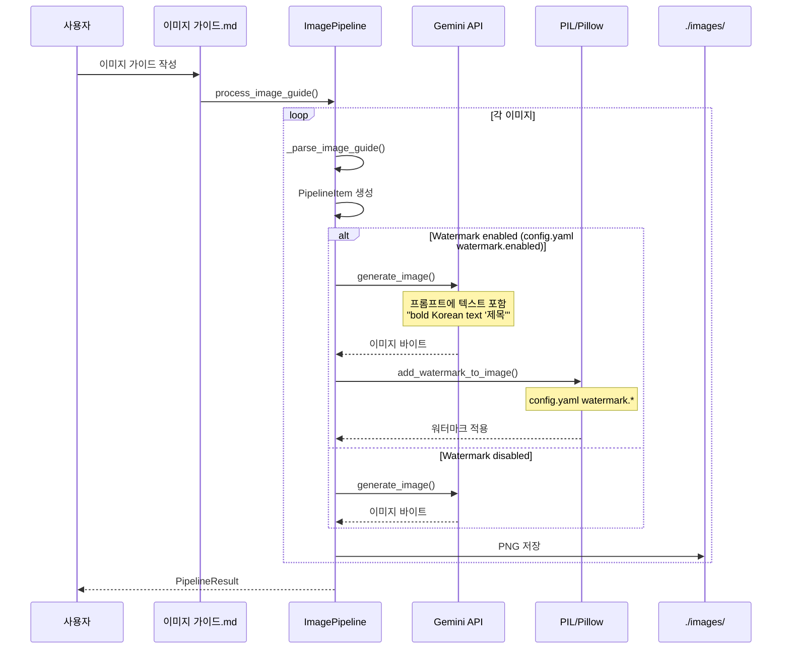
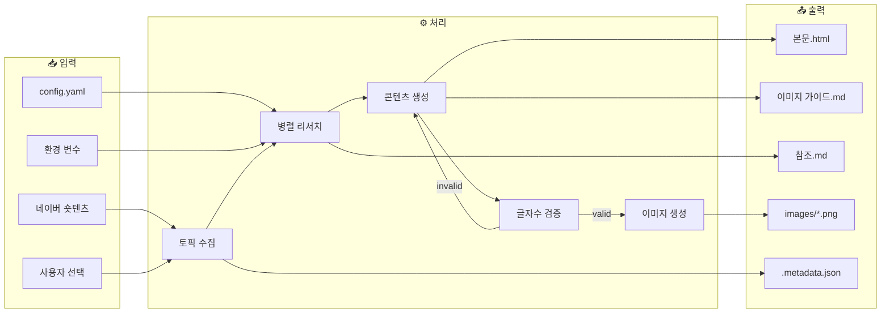
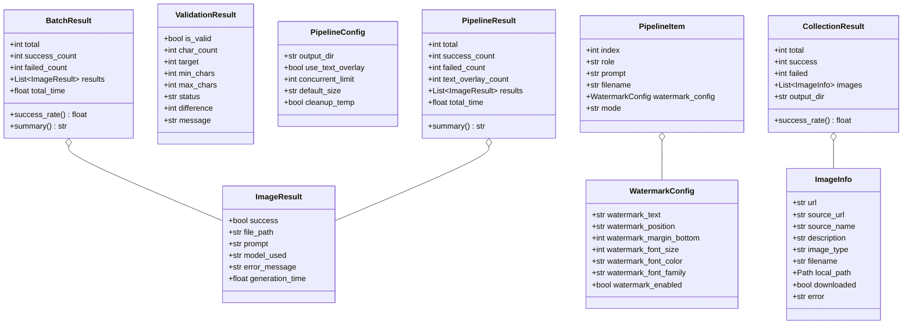

# search-blogging 파이프라인 분석 리포트

> **Version**: 2.1.0
> **Generated**: 2026-02-01
> **Author**: Claude Code Analysis

---

## 1. Executive Summary

### 프로젝트 개요
**search-blogging**은 네이버 경제 숏텐츠에서 트렌딩 토픽을 수집하여 약 1900자(±50, 1850~1950) 분량의 한국어 블로그 포스트를 자동 생성하고, AI 이미지까지 함께 생성하는 Claude Code 스킬입니다.

### 핵심 기술 스택
| 계층 | 기술 | 용도 |
|------|------|------|
| **데이터 수집** | Chrome DevTools MCP | 네이버 숏텐츠 크롤링 |
| **검색** | WebSearch, Naver Search MCP | 6개 병렬 리서치 에이전트 |
| **이미지 생성** | Google Gemini API | 3단계 폴백 AI 이미지 생성 |
| **이미지 처리** | PIL/Pillow | 워터마크 오버레이 |
| **설정 관리** | PyYAML | YAML 기반 설정 |
| **SVG 변환** | cairosvg/rsvg-convert | SVG → PNG 변환 |

### 9단계 워크플로우 요약

```
STEP 1 → STEP 2 → STEP 3 → STEP 4 → STEP 5 → STEP 6 → STEP 7 → STEP 8 → STEP 9
트렌딩   토픽      병렬     리뷰     옵션     제목     본문     이미지    수정
수집     확정     리서치    종합     선택     선택     작성     생성     루프
11%     22%      33%      44%      55%      66%      77%      88%     100%
```

---

## 2. 전체 파이프라인 흐름도



---

## 3. 단계별 상세 분석

### 3.1 STEP 1: 트렌딩 토픽 수집

**위치**: `skills/step1-collect.md`

#### 실행 흐름
1. **Chrome DevTools MCP 접속**
   - `mcp__chrome-devtools__navigate_page` 호출
   - URL: 네이버 경제 종합 숏텐츠 페이지

2. **페이지 스냅샷 캡처**
   - `mcp__chrome-devtools__take_snapshot` 호출
   - DOM 구조 파싱

3. **토픽 추출 로직**
   ```
   추출 대상:
   - 숏텐츠 링크 (uid 패턴)
   - 제목 (StaticText)
   - 시간 정보 (N시간 전, N일 전)
   ```

4. **선정 기준**
   | 우선순위 | 기준 | 설명 |
   |---------|------|------|
   | 1 | 시의성 | 24시간 이내 뉴스 우선 |
   | 2 | 검색량 | 트렌딩 순위 높은 것 |
   | 3 | 블로그 적합성 | 정보성 콘텐츠 적합 |
   | 4 | 독자 관심도 | 일상 생활 관련성 |

5. **사용자 선택**
   - `AskUserQuestion` 도구 사용
   - 1-4번, 5-8번 두 그룹으로 제시

---

### 3.2 STEP 2: 토픽 확정 및 키워드 확장

**위치**: `skills/step2-confirm.md`

#### 실행 흐름
1. **토픽 확정**
   - 사용자 선택 토픽 확인
   - 직접 입력 토픽 지원

2. **키워드 확장**
   - 동의어 생성
   - 관련 키워드 추가
   - 검색 쿼리 최적화

3. **프로젝트 디렉토리 생성**
   ```python
   # scripts/setup.py
   create_project_structure(topic, base_dir, date)
   ```

	   **출력 구조**:
	   ```
	   ./경제 블로그/YYYY-MM-DD/topic-name/
	   ├── images/
	   └── .metadata.json
	   ```

4. **메타데이터 초기화**
   ```json
	   {
	     "topic": "선택된 토픽",
	     "created_at": "YYYY-MM-DDT00:00:00",
	     "status": "initialized",
	     "config": {
	       "char_count": 1900,
	       "image_count": 5,
	       "tag_count": 8
	     }
	   }
   ```

---

### 3.3 STEP 3: 병렬 리서치 (6 에이전트)

**위치**: `skills/step3-research.md`

#### 병렬 에이전트 구성



#### 각 에이전트 역할

| Agent | 도구 | 수집 대상 | 목표 |
|-------|------|----------|------|
| 1 | WebSearch (site:news.naver.com) | 뉴스 + 이미지 | 5개 |
| 2 | mcp__naver-search__search_blog | 블로그 + 이미지 | 5개 |
| 3 | WebSearch | 공식 기관/금융사 | 5개 |
| 4 | WebSearch | 확장 키워드 검색 | 5개 |
| 5 | WebSearch | 확장 키워드 검색 | 5개 |
| 6 | WebSearch | 이미지 전용 | 10-15개 |

#### 이미지 수집 우선순위
| 순위 | 유형 | 용도 |
|------|------|------|
| 1 | 인포그래픽 | 핵심 정보 섹션 |
| 2 | 비교표/차트 | 데이터 비교 |
| 3 | 절차 가이드 | 가이드/팁 섹션 |
| 4 | 제품/서비스 | 본문 시각 자료 |
| 5 | 감성 이미지 | 도입/마무리 |

#### 이미지 다운로드 (scripts/collector.py)
```python
from scripts.collector import collect_images, CollectionResult

result: CollectionResult = collect_images(images, output_dir)
# result.total: 총 시도
# result.success: 성공 수
# result.failed: 실패 수
# result.images: List[ImageInfo]
```

---

### 3.4 STEP 4: 리뷰 및 종합

**위치**: `skills/step4-review.md`

#### 실행 흐름
1. **자료 충분성 평가**
   - 텍스트 자료: 15-25개 목표
   - 참고 이미지: 10-15개 목표

2. **핵심 정보 추출**
   - 중복 제거
   - 신뢰도 평가
   - 핵심 포인트 정리

3. **아웃라인 작성**
   - 7단계/5단계/자유 구조
   - 섹션별 글자수 배분

4. **참조 문서 생성 (scripts/writer.py)**
   ```python
   references_md = generate_references(
       topic=topic,
       text_sources={"네이버 뉴스": [...], "네이버 블로그": [...]},
       images=collected_images,
       date=date
   )
   ```

---

### 3.5 STEP 5: 작성 옵션 선택

**위치**: `skills/step5-options.md`

#### 5-1. 어조 선택
| 어조 | 설명 | 적합 주제 |
|------|------|----------|
| **전문적** | 합니다/습니다, 객관적 | 금융, 건강, 법률, 기술 |
| **친근한** | 비격식체, 대화형 | 육아, 리뷰, 취미, 일상 |
| **중립적** | 혼합, 정보 전달 중심 | 비교, 가이드, 뉴스 |

#### 5-2. 구조 선택
| 구조 | 섹션 수 | 설명 |
|------|--------|------|
| **7단계** | 7 | 도입→문제→핵심1,2,3→팁→마무리 |
| **5단계** | 5 | 도입+문제→핵심→상세→팁→마무리 |
| **자유** | 가변 | AI가 주제에 맞게 구성 |

#### 5-3. 이미지 수 선택
- 기본값: 5개
- 범위: 3-10개
- 환경 변수: `BLOG_IMAGE_COUNT`

---

### 3.6 STEP 6: 제목 선택

**위치**: `skills/step6-title.md`

#### 제목 생성 전략
1. **3개 후보 생성**
   - 정보 전달형: "2026년 육아휴직 완벽 가이드"
   - 호기심 유발형: "육아휴직, 이렇게 달라진다?"
   - 숫자 활용형: "육아휴직 5가지 핵심 변경사항"

2. **SEO 최적화**
   - 키워드 포함
   - 70자 이내
   - 클릭 유도 요소

3. **무제한 재생성 지원**

---

### 3.7 STEP 7: 본문 작성 및 저장

**위치**: `skills/step7-write.md`

#### 7-1. 글자수 규칙

```
┌─────────────────────────────────────┐
│        글자수 검증 규칙              │
├─────────────────────────────────────┤
│ 목표: 1900자                        │
│ 허용 범위: 1850 ~ 1950자            │
│ 공백 포함: ✅                        │
├─────────────────────────────────────┤
│ 제외 항목:                          │
│ - HTML 태그                         │
│ - [이미지 N 삽입] 플레이스홀더       │
│ - CSS 스타일 코드                   │
│ - 해시태그 목록                     │
└─────────────────────────────────────┘
```

#### 7-2. 글자수 검증 (scripts/validator.py)

```python
from scripts.validator import validate_char_count, ValidationResult

result: ValidationResult = validate_char_count(html_content)
# result.is_valid: bool
# result.char_count: int (실제 글자수)
# result.status: "ok" | "under" | "over"
# result.message: str
```

#### 7-3. HTML 생성 (scripts/writer.py)

```python
from scripts.writer import generate_html_content, save_blog_files

html_content = generate_html_content(
    title="제목",
    sections=[
        {"title": "도입", "content": "...", "has_image": False},
        {"title": "핵심 정보 1", "content": "...", "has_image": True},
    ],
    tags=["태그1", "태그2"]
)

files = save_blog_files(
    project_path=project_path,
    html_content=html_content,
    image_guide=image_guide_md,
    references=references_md,
    validate=True
)
```

#### 7-4. 이미지 생성 모드

| 모드 | 심볼 | 설명 | 처리 방식 |
|------|------|------|----------|
| **A** | 📷 | 참고 이미지 | 다운로드된 이미지 사용 |
| **B** | 🎨 | AI 생성 | Gemini API |
| **B-3** | 🎨 | AI 생성 + 워터마크 | Gemini API + PIL |
| **C** | 🔷 | SVG 생성 | svg-canvas-mcp |

---

### 3.8 STEP 8: 이미지 생성

**위치**: `skills/step8-image.md`

#### 이미지 생성 흐름



#### 이미지 생성 모드

| 모드 | 설명 | 처리 방식 |
|------|------|----------|
| **Mode A** | 참고 이미지 다운로드 | URL에서 직접 다운로드 |
| **Mode B** | AI 생성 | Gemini API |
| **Mode B-3** | AI 생성 + 워터마크 | Gemini API + PIL (권장) |

---

### 3.9 STEP 9: 수정 루프

**위치**: `skills/step9-revise.md`

#### 수정 루프 흐름



---

## 4. Python 모듈 아키텍처

### 모듈 의존성 맵



### 모듈 계층 구조

```
┌─────────────────────────────────────────────────────────────┐
│                    PRESENTATION LAYER                        │
│                   (skills/*.md 파일)                         │
└─────────────────────────────────────────────────────────────┘
                              ↓
┌─────────────────────────────────────────────────────────────┐
│                    APPLICATION LAYER                         │
├─────────────────────────────────────────────────────────────┤
│  image_pipeline.py    │  writer.py    │  collector.py       │
│  (이미지 파이프라인)   │  (콘텐츠 생성) │  (이미지 수집)      │
└─────────────────────────────────────────────────────────────┘
                              ↓
┌─────────────────────────────────────────────────────────────┐
│                    DOMAIN LAYER                              │
├─────────────────────────────────────────────────────────────┤
│  gemini_image.py      │  text_overlay.py  │  validator.py   │
│  (Gemini API)         │  (PIL 처리)       │  (글자수 검증)   │
├─────────────────────────────────────────────────────────────┤
│  prompt_converter.py  │  setup.py                           │
│  (프롬프트 변환)      │  (프로젝트 설정)                     │
└─────────────────────────────────────────────────────────────┘
                              ↓
┌─────────────────────────────────────────────────────────────┐
│                    INFRASTRUCTURE LAYER                      │
├─────────────────────────────────────────────────────────────┤
│  config.py            │  utils.py         │  shared_types.py│
│  (설정 관리)          │  (유틸리티)       │  (타입 정의)     │
└─────────────────────────────────────────────────────────────┘
```

---

## 5. 이미지 생성 파이프라인 상세

### Mode B-3 워크플로우 (권장)



### Gemini API 3단계 폴백 시스템

```mermaid
flowchart TB
    subgraph Tier1["🥇 Tier 1: gemini.models.primary"]
        M1[gemini-3-pro-image-preview]
    end

    subgraph Tier2["🥈 Tier 2: gemini.models.fallback"]
        M2[gemini-2.5-flash-image]
    end

    subgraph Tier3["🥉 Tier 3: gemini.models.fallback_2"]
        M3[gemini-2.0-flash-exp-image-generation]
    end

    Start[이미지 생성 요청] --> M1
    M1 -->|성공| Success[이미지 저장]
    M1 -->|429/QUOTA_EXCEEDED| Wait1[대기 (config)]
    M1 -->|SAFETY/RECITATION| Wait1
    Wait1 --> M2

    M2 -->|성공| Success
    M2 -->|429/QUOTA_EXCEEDED| Wait2[대기 (config)]
    M2 -->|SAFETY/RECITATION| Wait2
    Wait2 --> M3

    M3 -->|성공| Success
    M3 -->|실패| Fail[에러 반환]

    style Tier1 fill:#e3f2fd
    style Tier2 fill:#fff3e0
    style Tier3 fill:#ffebee
```

### 폴백 트리거 조건

| 에러 유형 | 코드/메시지 | 폴백 동작 |
|----------|------------|----------|
| Rate Limit | `429`, `ResourceExhausted` | 설정된 지연 후 다음 모델 |
| Quota 초과 | `QUOTA_EXCEEDED` | 즉시 다음 모델 |
| 콘텐츠 차단 | `SAFETY`, `blocked` | 즉시 다음 모델 |
| 필터링 | `RECITATION`, `filtered` | 즉시 다음 모델 |
| 지원 안함 | `INVALID_ARGUMENT` | 즉시 다음 모델 |

### Rate Limit 관리

```python
# config.yaml 설정
gemini:
  rate_limit:
    requests_per_minute: 10      # 보수적 제한 (실제: 15)
    delay_between_requests: 6.0  # 60s / 10 = 6s
```

---

## 6. 데이터 흐름 다이어그램



### 출력 디렉토리 구조

```
./경제 블로그/
└── 2026-02-01/
    └── 육아휴직-급여/
        ├── 본문.html              # 블로그 HTML (네이버 블로그 붙여넣기용)
        ├── 이미지 가이드.md       # 이미지 생성 프롬프트
        ├── 참조.md               # 출처 참조
        ├── .metadata.json        # 프로젝트 메타데이터
        └── images/
            ├── 01_썸네일.png      # Gemini 자동 생성
            ├── 02_인포그래픽.png
            ├── 03_비교표.png
            ├── 04_절차가이드.png
            └── 05_마무리.png
```

---

## 7. 에러 처리 패턴

### Result Object 패턴

모든 주요 작업은 성공/실패 정보를 담은 Result 객체를 반환합니다.

```python
@dataclass
class ImageResult:
    success: bool
    file_path: Optional[str] = None
    prompt: str = ""
    model_used: str = ""
    error_message: Optional[str] = None
    generation_time: float = 0.0

@dataclass
class BatchResult:
    total: int = 0
    success_count: int = 0
    failed_count: int = 0
    results: List[ImageResult] = field(default_factory=list)
    total_time: float = 0.0

    @property
    def success_rate(self) -> float:
        return (self.success_count / self.total * 100) if self.total else 0.0

@dataclass
class ValidationResult:
    is_valid: bool
    char_count: int = 0
    target: int = 1900
    min_chars: int = 1850
    max_chars: int = 1950
    status: str = "ok"  # "ok", "under", "over"
    difference: int = 0
    message: str = ""
```

### 재시도 전략

```python
# gemini_image.py
DEFAULT_RETRY_COUNT = 3
DEFAULT_RATE_LIMIT_DELAY = 6.0  # seconds

async def _generate_with_model(self, ...):
    for attempt in range(self.retry_count):
        try:
            return await self._generate_with_gemini(...)
        except Exception as e:
            if "429" in str(e) or "ResourceExhausted" in str(e):
                wait_time = delay * (attempt + 1)  # 지수 백오프
                await asyncio.sleep(wait_time)
                continue
```

---

## 8. 설정 시스템

### config.yaml 구조

```yaml
# 앱 정보
app:
  name: search-blogging
  version: "2.1.0"

# 글쓰기 설정
writing:
  char_count: 1900        # 목표 글자수
  char_tolerance: 50      # 허용 오차
  min_chars: 1850
  max_chars: 1950

# 이미지 설정
images:
  default_count: 5
  min_count: 3
  max_count: 10
  download_timeout: 30

# Gemini API 설정
gemini:
  enabled: true
  models:
    primary: "gemini-3-pro-image-preview"
    fallback: "gemini-2.5-flash-image"
    fallback_2: "gemini-2.0-flash-exp-image-generation"
  rate_limit:
    requests_per_minute: 10
    delay_between_requests: 6.0

# 워터마크 설정
watermark:
  enabled: true
  text: "@money-lab-brian"
  position: "bottom-center"
  margin_bottom: 60
  font_size: 18
  font_color: "rgba(255,255,255,0.6)"

# 출력 설정
output:
  base_dir: "./경제 블로그"
  date_format: "%Y-%m-%d"
```

### 환경 변수 오버라이드

| 환경 변수 | 대상 설정 | 타입 |
|----------|----------|------|
| `GOOGLE_API_KEY` | Gemini API 키 | str |
| `GEMINI_API_KEY` | Gemini API 키 (대체) | str |
| `BLOG_CHAR_COUNT` | writing.char_count | int |
| `BLOG_IMAGE_COUNT` | images.default_count | int |
| `BLOG_OUTPUT_DIR` | output.base_dir | str |
| `BLOG_TAG_COUNT` | tags.count | int |

### 싱글톤 패턴

```python
# config.py
_config_instance: Optional[Dict[str, Any]] = None

def get_config() -> Dict[str, Any]:
    global _config_instance
    if _config_instance is None:
        _config_instance = load_config()
    return _config_instance

def reload_config() -> Dict[str, Any]:
    global _config_instance
    _config_instance = load_config()
    return _config_instance
```

---

## 9. 외부 의존성

### Python 패키지

| 패키지 | 버전 | 용도 | 필수 여부 |
|--------|------|------|----------|
| `PyYAML` | ≥6.0 | YAML 설정 파싱 | ✅ 필수 |
| `google-genai` | ≥0.4.0 | Gemini API (새 SDK) | ✅ 필수 |
| `pillow` | ≥10.0.0 | 이미지 처리/워터마크 | ✅ 필수 |
| `cairosvg` | ≥2.7.0 | SVG → PNG 변환 | ⚪ 선택 |

### MCP 서버

| 서버 | 용도 |
|------|------|
| `chrome-devtools` | 네이버 페이지 크롤링 |
| `naver-search` | 네이버 블로그 검색 |
| `svg-canvas-mcp` | SVG 이미지 생성 |

### Gemini API 모델

| config.yaml key | 모델 ID |
|----------------|--------|
| `gemini.models.primary` | `gemini-3-pro-image-preview` |
| `gemini.models.fallback` | `gemini-2.5-flash-image` |
| `gemini.models.fallback_2` | `gemini-2.0-flash-exp-image-generation` |

---

## 10. 핵심 데이터클래스



---

## 11. 성능 및 제약 사항

### Rate Limits

- Rate limiting/delay is configured in `config.yaml` (`gemini.rate_limit.*`) and enforced by the generator.
- Model fallback order is configured in `config.yaml` (`gemini.models.primary` → `fallback` → `fallback_2`).
- Pipeline concurrency is controlled by `process_image_guide(..., concurrent_limit=...)`.

### 글자수 제약

| 항목 | 값 |
|------|-----|
| 목표 | 1900자 |
| 최소 | 1850자 |
| 최대 | 1950자 |
| 허용 오차 | ±50자 |

### 이미지 크기 표준 (네이버 블로그)

| 유형 | 크기 | 비율 | 용도 |
|------|------|------|------|
| 썸네일 | 1300×885 | 1.47:1 | OG 이미지, 검색 결과 |
| 기본 콘텐츠 | 693×450 | - | 본문 기본 폭 |
| 확장 콘텐츠 | 886×500 | - | 본문 확장 폭 |
| 정사각형 | 700×700 | 1:1 | 인스타그램 스타일 |
| 차트 | 800×500 | 16:10 | 차트/그래프 |
| 인포그래픽 | 886×800 | - | 세로형 인포그래픽 |

---

## 12. 사용 예시

### 기본 사용 흐름

```bash
# 1. 환경 설정
python3 ~/.claude/skills/search-blogging/scripts/ensure_venv.py

# 2. API 키 설정
export GOOGLE_API_KEY="your-api-key"

# 3. Claude Code에서 스킬 실행
/search-blogging
```

### Python API 직접 사용

```python
# 프로젝트 생성
from scripts.setup import create_project_structure
project_path = create_project_structure("육아휴직 급여")

# 이미지 수집
from scripts.collector import collect_images
result = collect_images(images, project_path)

# 콘텐츠 생성
from scripts.writer import generate_html_content, save_blog_files
html = generate_html_content(title, sections, tags)
files = save_blog_files(project_path, html, image_guide, references)

# 이미지 생성
from scripts.image_pipeline import ImagePipeline
pipeline = ImagePipeline()
result = await pipeline.process_image_guide(content, output_dir)

# 글자수 검증
from scripts.validator import validate_char_count
validation = validate_char_count(html)
print(validation.message)
```

---

## 13. 버전 히스토리

| 버전 | 날짜 | 주요 변경사항 |
|------|------|--------------|
| 2.0.0 | 2026-01 | AI 텍스트 렌더링 + 워터마크 파이프라인 |
| 1.5.0 | 2025-12 | 3단계 Gemini 폴백 시스템 |
| 1.0.0 | 2025-11 | 초기 8단계 워크플로우 |

---

## 14. 참고 자료

- **스킬 진입점**: `/Users/hj/.claude/skills/search-blogging/SKILL.md`
- **프로젝트 설명**: `/Users/hj/.claude/skills/search-blogging/CLAUDE.md`
- **설정 파일**: `/Users/hj/.claude/skills/search-blogging/config.yaml`
- **Python 모듈**: `/Users/hj/.claude/skills/search-blogging/scripts/`
- **워크플로우 스킬**: `/Users/hj/.claude/skills/search-blogging/skills/`

---

*Generated by Claude Code Pipeline Analysis*
